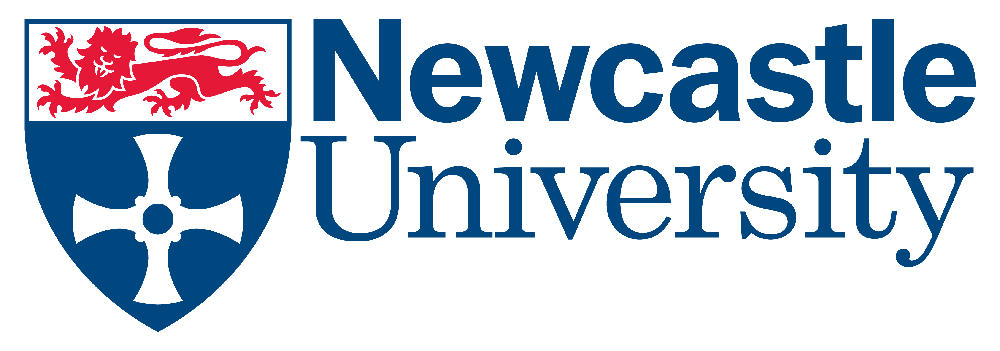

<h2 style="text-align:center">Meeting Graduate Employability Needs through Open-source Collaboration with Industry</h2>

Matthew Forshaw, Ellis Solaiman, Oonagh McGee, Hugo Firth, Paul Robinson, Ryan Emerson

<!-- 

    

    

 -->

## Abstract
This paper describes the development and delivery of a course, in close collaboration with industry, over a ten-year period.  We describe the details of this collaboration, which aims to equip students with collaborative software development experience, incorporating open source, Enterprise Middleware technologies and industry best practices. In presenting our case study we share valuable insights, into the challenges and opportunities, for all parties involved. We present the reflections of all stakeholders, including; the course leader, the industrial partner, lab demonstrators, and students. We also present the results of our investigations to track the employment of our graduates over the last five years, identifying that all students who responded are employed within relevant positions or undertaking further study. Based on our successful delivery of the course, in this paper we make all tools and teaching materials available to the open source community, for delivery at other institutions. We emphasise the importance of the continued involvement of industry partners to inform pedagogical practices within Computer Science.

## Open Courseware
Here we make all tools and teaching materials available to the open source community, for delivery at other institutions. The open source courseware repository is available <a href="https://github.com/NewcastleComputingScience/enterprise-middleware-coursework">here</a>.

If you want to run this coursework at your institution, then we encourage you to do so. Please <a href="mailto:matthew.forshaw@ncl.ac.uk">contact us</a> and we will be happy to provide you with sample solutions, instructor guidelines, and assist you running the course at your own institution.

## SIGCSE 2016
We look forward to presenting at SIGCSE 2016 in Memphis this year. 

Please join us in **L13-14** at **08:45am** on **Saturday 5th March**.

## Publications
Forshaw, M., Solaiman, E., McGee, O., Firth, H., Robinson, P., & Emerson, R. (2016). Meeting Graduate Employability Needs through Open-source Collaboration with Industry. In <em>47th ACM Technical Symposium on Computer Science Education (SIGCSE)</em>, 2016.

<!-- 

 -->

    

    

